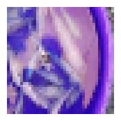

# Predict animal names from photos with PyTorch

* selecting images from the dataset according to the index
```python
fig, ax = plt.subplots(figsize=(5, 5))

index_to_display = 15 #Ubah sesuai keinginan
img, label = dataset[index_to_display]

ax.axis("off")
ax.imshow(img.permute(1, 2, 0).numpy().astype(int))

plt.show()
```

* Example Output




* If you run code :
```python
with torch.no_grad():
    img, label = dataset[index_to_display]
    output = model(img)

predicted_class = output.argmax().item()
predicted_label = reverse_mapping[predicted_class]

print(f"Predicted Label: {predicted_label}")
```

* Example Output

```bash
Predicted Label: Fish
```